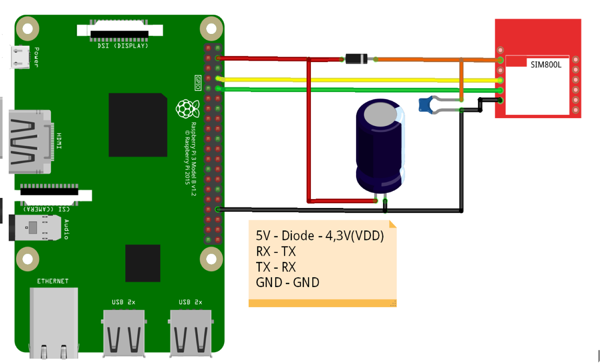

# Installer for SIM800L Modem on Raspberry Pi

## Prerequisites

* HoneyPi Firmware [as provided by HoneyPi](https://github.com/Honey-Pi/HoneyPi)


## Installer

```
sudo apt-get update && sudo apt-get dist-upgrade -y
sudo apt-get install -y git
cd ~
git clone --depth=1 https://github.com/Honey-Pi/honeypi-pcb.git
cd honeypi-pcb/Modem
sudo sh install-sim800.sh
```

## Circuit Board



## Full Documentation (in German)

Please download this Word file: [Modem.docx](https://github.com/Honey-Pi/honeypi-pcb/raw/master/Modem/Modem.docx) 
