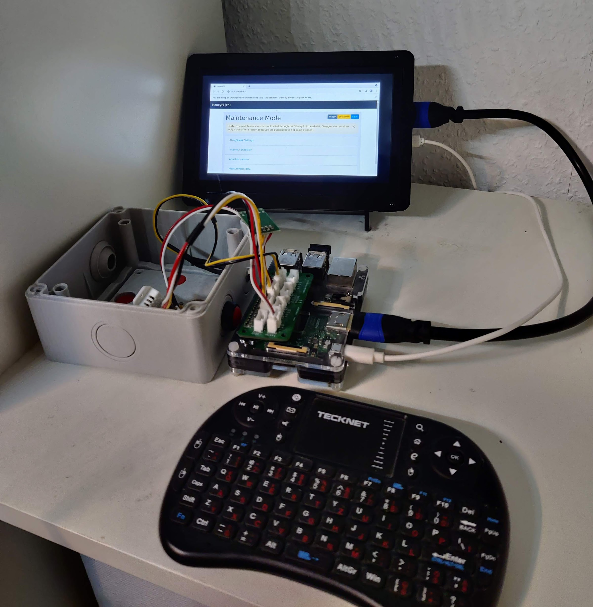
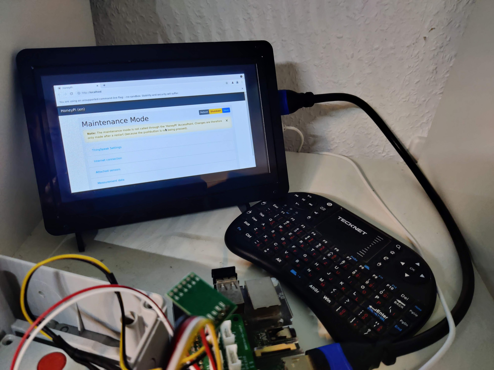

# Installer for headless Chrome on Raspberry Pi OS Lite

## Software Prerequisites

* HoneyPi Firmware [as provided by HoneyPi](https://github.com/Honey-Pi/HoneyPi) or a [Raspberry Pi OS **Lite**](https://www.raspberrypi.com/software/operating-systems/) Image

## Hardware Prerequisites

* [Raspberry Pi 3 or any newer model](https://www.rasppishop.de/?shop=hop)
* [7" inch Display for Raspberry Pi 1024x600](https://www.amazon.de/gp/product/B07YJDSCKR?ie=UTF8&linkCode=ll1&tag=honeypi-21&linkId=8acf308e226e55e80d1dae4e6bac7e6e&language=de_DE&ref_=as_li_ss_tl)
* [Case for 7inch Display](https://www.amazon.de/gp/product/B07TQMGWLP?ie=UTF8&linkCode=ll1&tag=honeypi-21&linkId=afe1b48e72075dac3b4475e6f6984e3a&language=de_DE&ref_=as_li_ss_tl)
* HDMI Cable (maybe with adapter depends on your Raspberry Pi model) + USB Cable for power

## Installer

```
sudo apt-get update && sudo apt-get dist-upgrade -y
sudo apt-get install -y git
cd ~
git clone --depth=1 https://github.com/Honey-Pi/honeypi-pcb.git
cd honeypi-pcb/Monitor
sudo sh install-monitor.sh
```


Run `sudo startx /etc/xdg/openbox/autostart` via SSH or directly on your terminal to open the browser on your monitor. You can connect any keyboard/mouse to control your system.

## Demo



