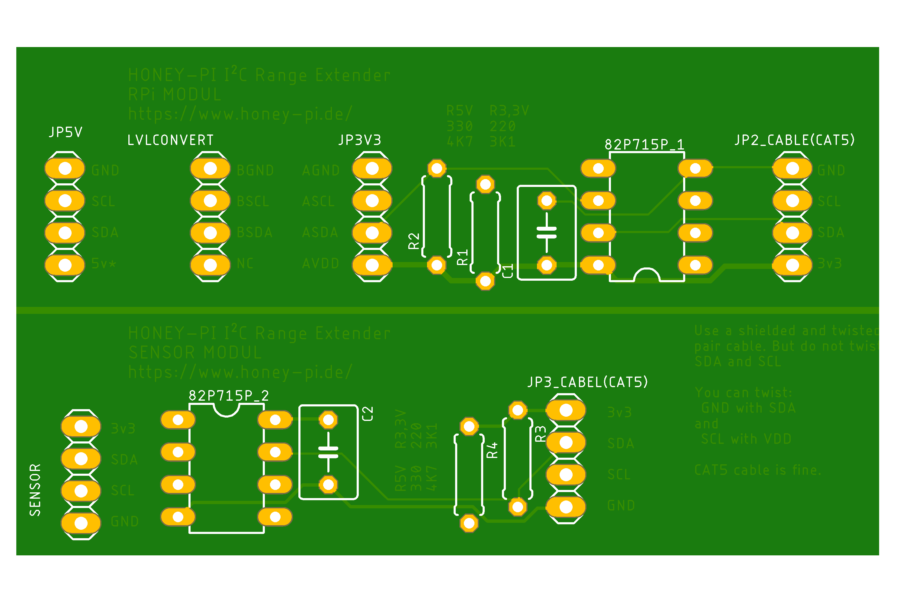

# HoneyPI-PCB I2C_Extenter

Extension board for the HoneyPi-PCB 2.x.  
Pitch lenght 2.54 mm for pins or...  
Designed to be connect to a Raspberry Pi on the I²C

(-> Two modules on one board, so a saw is needed)

Feature list and bill of material is still on working.   

## V2.0 BETA circuit diagram [link](./HoneyPI_I2C_Extenter.pdf)
Check out this [blogpost](https://www.honey-pi.de/)

Status: Under development.  
This version is currently being procured and tested.  
Please do not order these without having contacted us before.  
Thank you for your understanding!  

NOT YET: You can upload this [gerber file](./HoneyPI_I2C_Extenter_2020-12-14.zip) to [this manufactory service](https://jlcpcb.com/quote) to get few PCBs. 10 pieces of this board cost about 7 € with delivery. 

### Pictures

