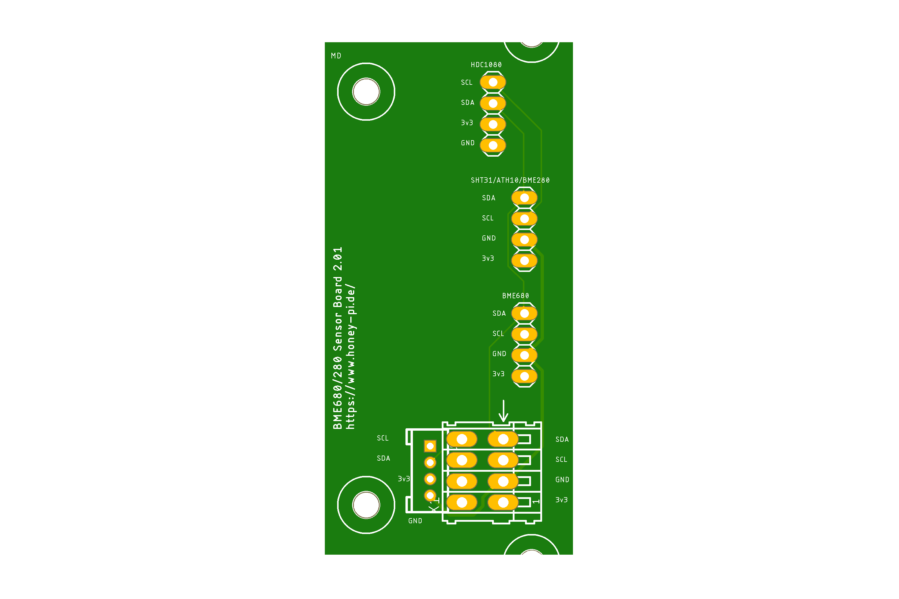

# HoneyPI-PCB Sensor Board 2.x BME280/BME680

Extension board for the HoneyPi-PCB 2.x.  
Pitch lenght 2.0 mm for Grove plugs or similar.  
Pitch lenght 2.54 mm for pins or...  
Designed to be mounted in a separate housing that allows humidity to be measured.  
1x BME680 or BME280 or 1x ATH10 or 1x HDC1080 or 1x sht31
--> We adapt these sensors because of the fixed i2c adresses. 

Feature list and bill of material is still on working.   

## V2.0x circuit diagram [link](./PCB_Sensor_Board_2.x_BME280_680_ATH10_HDC1080.pdf)
Check out this [blogpost](https://www.honey-pi.de/)

Status: Under development.  
This version is currently being procured and tested.  
Please do not order these without having contacted us before.  
Thank you for your understanding!  

You can upload this [gerber file](./PCB_Sensor_Board_2.x_BME280_680_ATH10_HDC1080.zip) to [this manufactory service](https://jlcpcb.com/quote) to get few PCBs. 10 pieces of this board cost about 7 € with delivery. 

### Pictures

