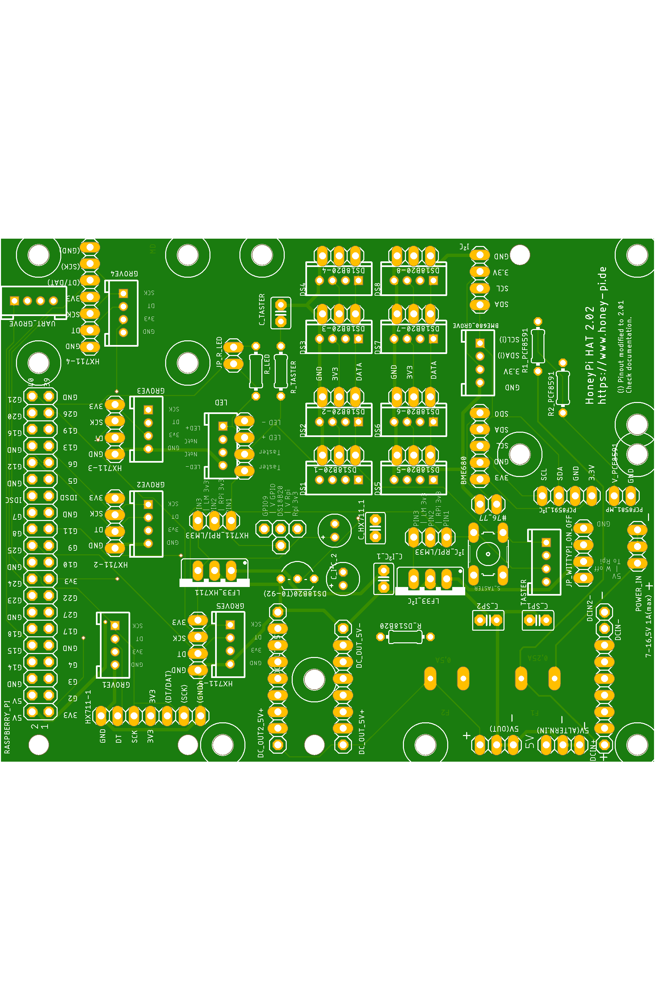

# HoneyPi-PCB 2.0x

Printed circuit board (PCB) for the Raspberry Pi ZERO to connect various sensors.  
Pitch lenght 2.x mm for Grove plugs or similar.  
Pitch lenght 2.54 mm for terminal blocks as an alternative. 
 
- Three differend possible power supplies possible.  

- 5x HX711...  

- 8x DS18b20 + 1x DS18b20 (TO-92 onboard)  

- 2x BME680 / BME280 

- 1x I²C interface (instead of second BME)

- 1x PCF8591

- incl. interface for the WittyPi / Timer Board

Designed for the Raspian Zero and NOT for Raspian Pi 1 to 4  
Feature list and bill of material is still on working.  
## You can find some helpfull instructions (only in German at the moment ) [here](./Bienenwaage_Platine_2.x_D2.04.pdf)

## V2.0x circuit diagram [link](./Schaltplan_2.02-21.01.2021.pdf)
Check out this [blogpost](https://honey-pi.de/neue-platine-v2-fuer-raspberry-zero/) for the Raspberry Zero.

Status: Tested, working.  
This version has been tested and found to be good and released.

Nevertheless I would like to support the first setups to enhance the instructions.

Please contact me if you are interested.  

You can upload this [gerber file](./HoneyPI_Platine_2.02_2021-01-05.zip) to [this manufactory service](https://jlcpcb.com/quote) to get few PCBs. 5 pieces of this board cost me about 7 € with delivery. 

### Pictures

Users of the board version 2.01: Please use the schematic 2.01.1 [link](./OLD/Schaltplan_2.01.1-21.01.2021.pdf)

