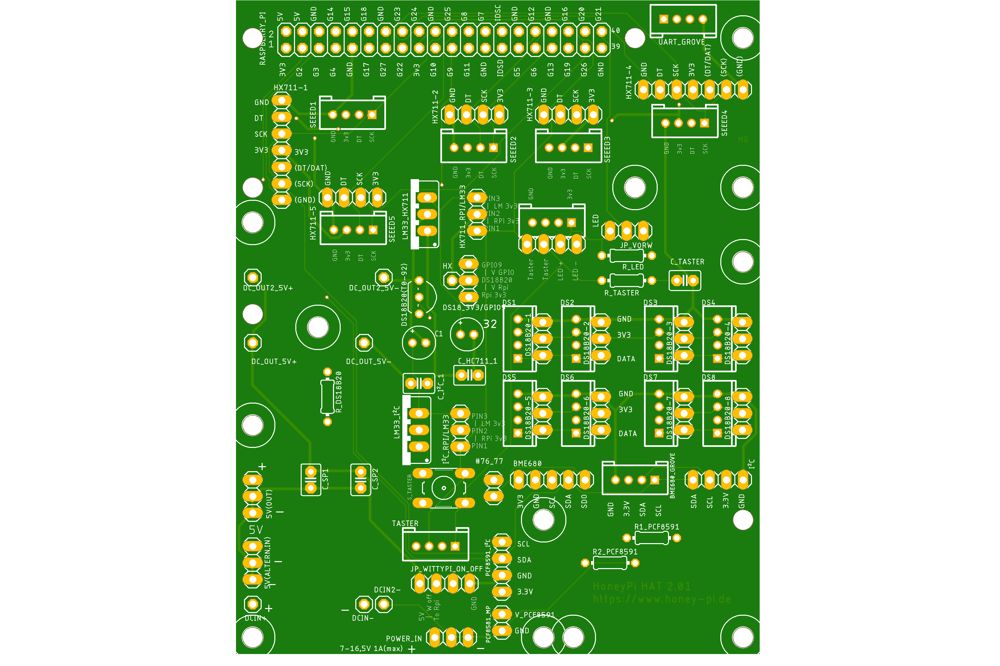

# HoneyPi-PCB 2.0 BETA

Printed circuit board (PCB) for the Raspberry Pi ZERO to connect various sensors.  
Pitch lenght 2.x mm for Grove plugs or similar  
Pitch lenght 2.54 mm for terminal blocks as an alternative  
Three differend possible power supplies possible  
5x HX711...  
8x DS18b20 + 1x DS18b20 (TO-92 onboard)  
2x BME680 / BME280 
1x I²C interface (instead of second BME)
1x PCF8591 
incl. WittyPi interface

Designed for the Raspian Zero and NOT for Raspian Pi 1 to 4  
Feature list and bill of material is still on working.  
## You can find instructions (only in German at the moment ) here[link](./Bienenwaage_Platine.v2.pdf)

## V2.0x circuit diagram [link](./Schaltplan-27-9-2020.pdf)
Check out this [blogpost](https://www.honey-pi.de/....) for the Raspberry Zero.

Status: Tested.  
This version has been tested and found to be good and released. 

Nevertheless I would like to support the first setups.

Please contact me if you are interested.  

You can upload this [gerber file](./HoneyPI_Platine_2.01_2020-09-27.zip) to [this manufactory service](https://jlcpcb.com/quote) to get few PCBs. 10 pieces of this board cost about 7 € with delivery. 

### Pictures

