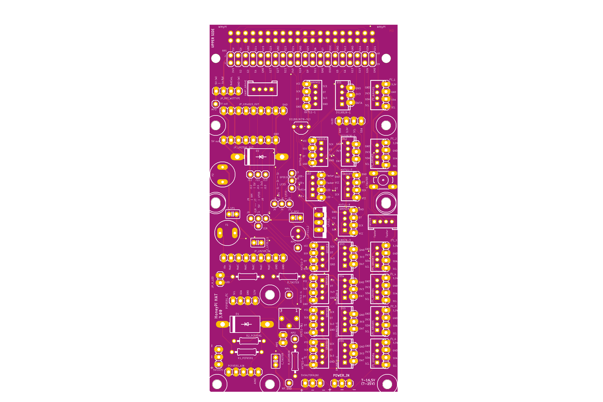

# HoneyPi-PCB 3.0x

Printed circuit board (PCB) for the Raspberry Pi 3 or 4 to connect various sensors.  
Pitch lenght 2.x mm for Grove plugs or similar.  
Pitch lenght 2.54 mm for terminal blocks as an alternative. 
 
- Three differend possible power supplies possible.  

- 8x HX711 in combination with the PCB_HoneyPI_2.0 Sensor Board HX711_DS18b20  

- 8x DS18b20 + 1x DS18b20 (TO-92 onboard)  

- 8x I2C: BME680, BME280, PCF8591, OLED ...

- incl. interface for the WittyPi (90° connector)

- Space for momentary buttons, resistors, capacitors as well to connect the LED 

Designed for the Raspberry Pi 3 and 4 and also for the Raspberry Pi Zero WH and Raspberry Pi Zero 2   
Feature list and bill of material is still on working.  

Net yet: ## V3.0x circuit diagram [link](./Schaltplan_3.0x.pdf)

Status: Testing.  
Please contact me if you are interested.  

Net yet: You can upload this [gerber file](./HoneyPI_Platine_3.00.zip) to [this manufactory service](https://jlcpcb.com/quote) to get few PCBs. 5 pieces of this board cost me about 7 € with delivery. 

### Pictures

