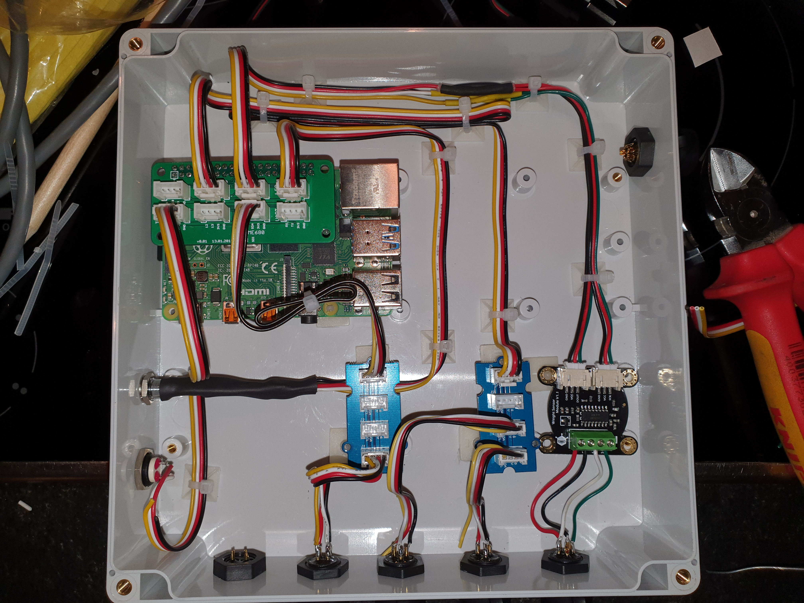
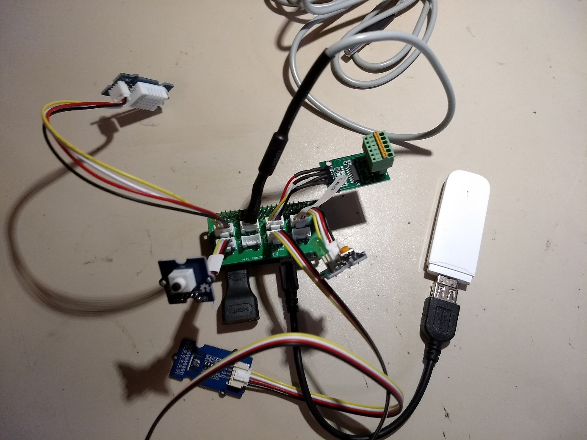
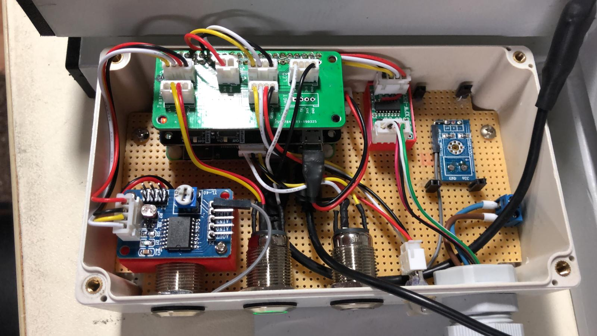

# honeypi-pcb

Printed circuit board (PCB) for the Raspberry Pi to connect various sensors. To avoid the use of jumper cables.

## V0.1 [link](./PCB_V0.1)
Check out this [blogpost](https://www.honey-pi.de/teil-3-adapter-lk-fuer-grove-stecker/) about the grove connector board for the Raspberry Zero.

You can upload the [gerber file](./PCB_V0.1/Grove Base HAT For Raspberry Pi Zero_2019-01-13.zip) to [this manufactory service](https://jlcpcb.com/quote). 10 pieces of this board cost about 7 € with delivery. 

### Pictures

